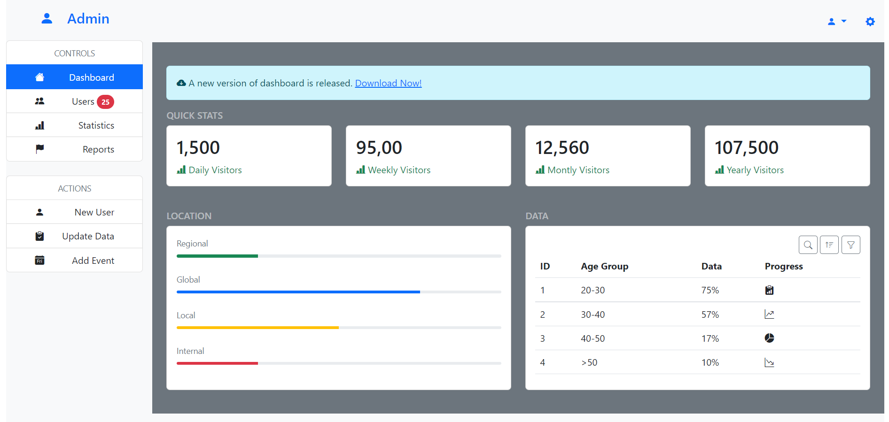
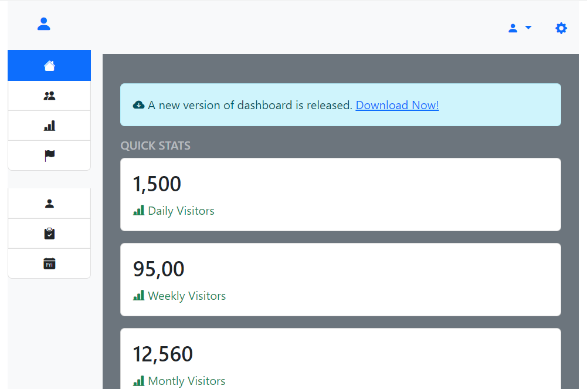
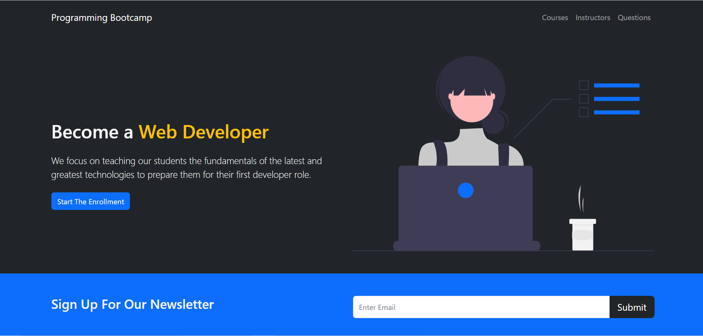
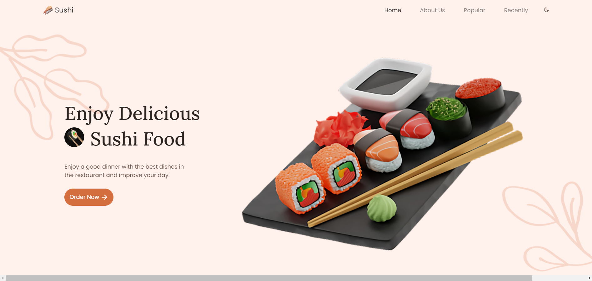
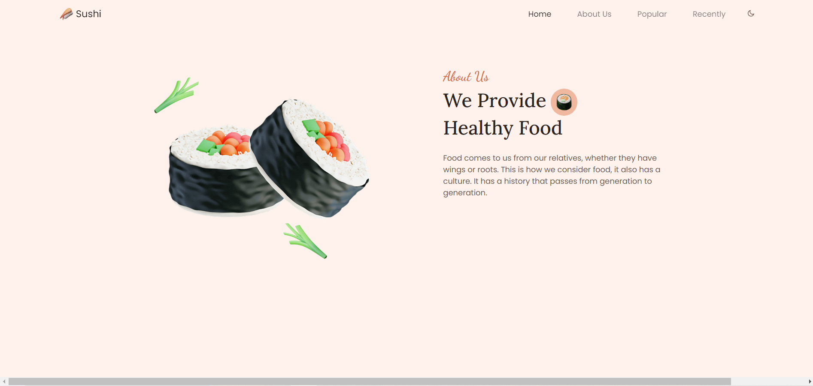
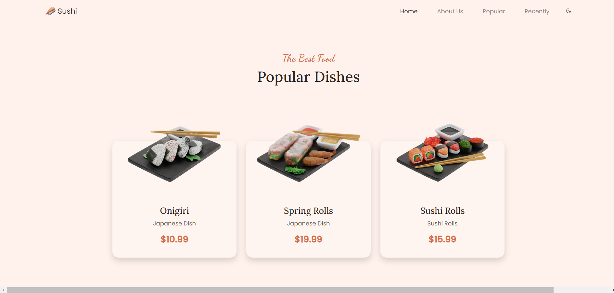
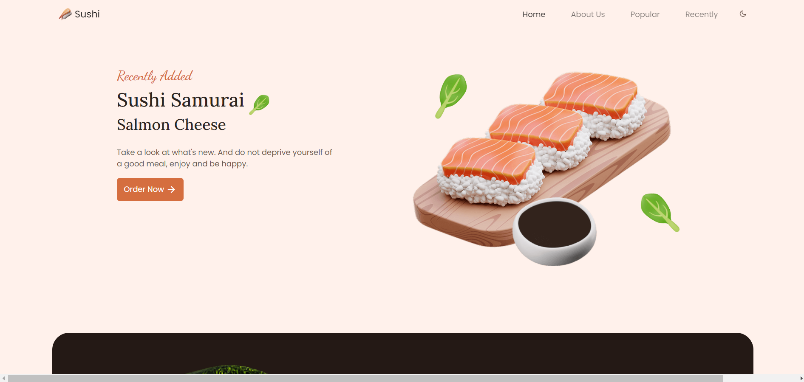
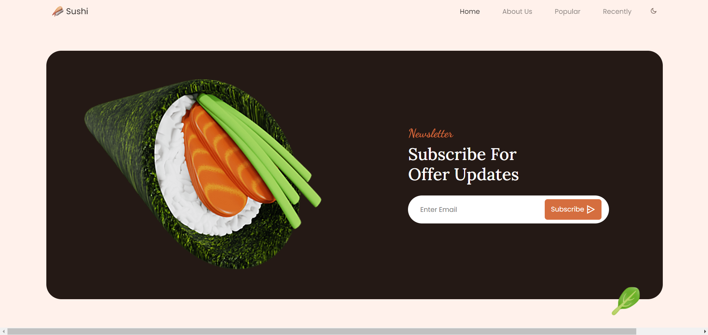

# Bootstrap-Projects
### 1.[Admin Dashboard Project](admin-dashboard-bootstrap5)

- Using Bootstrap 5 and Bootstrap Icons

### 2.[Programming Bootcamp Project](programming-bootcamp-bootstrap5/)

### 3.[Sushi Project](sushi-project/)

### 3.[Portfolio Project with Bootstrap5 and SCSS](portfolio-bootstrap5-scss/)